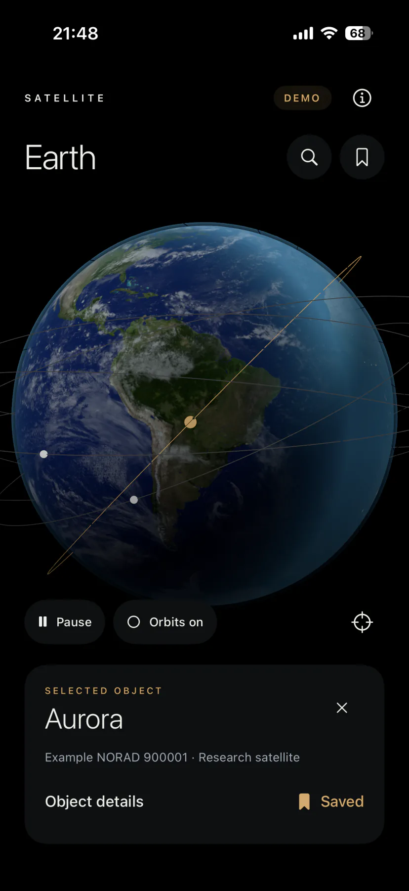
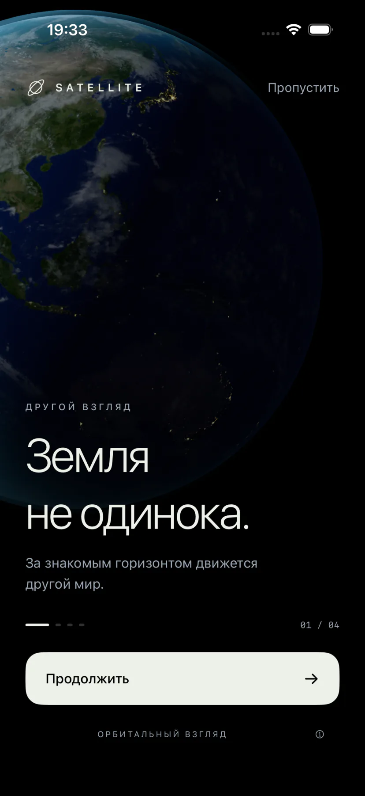
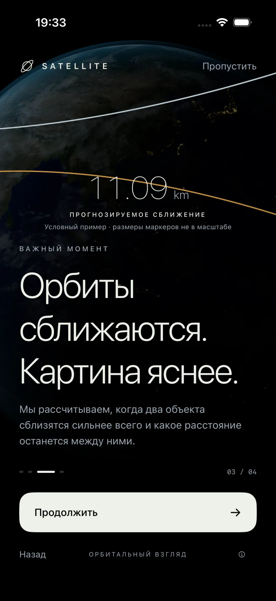
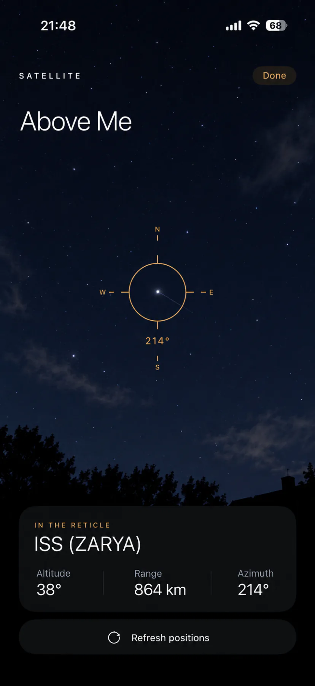

  

SPACE SITUATIONAL AWARENESS

# Satellite Collision Predictor

**Понять движение на орбите. Увидеть сближение во времени.**

Исследование траекторий орбитальных объектов 
и прогнозирование их близких прохождений.

---

## Пространство вокруг Земли — в движении

Спутники, ступени ракет и фрагменты космического мусора движутся по разным орбитам.
Чтобы понять, насколько близко могут пройти два объекта, важно знать не только
форму их траекторий, но и положение каждого в один и тот же момент времени.

**Satellite Collision Predictor** — проект о том, как превратить орбитальные
данные в понятную картину сближений: какие объекты встретятся ближе всего,
когда это произойдёт и какое расстояние их разделит.

## Приложение

<table>
<tr>
<td align="center"> Земля и орбитальные объекты</td>
<td align="center"> Онбординг: новый взгляд на Землю</td>
<td align="center"> Онбординг: прогноз сближений</td>
<td align="center"> «Надо мной»: концепт вида камеры</td>
</tr>
</table>

## Один момент. Две траектории.

В центре каждого события — пара объектов и момент их максимального сближения.

| Величина | Что она показывает |
| :--- | :--- |
| **Time of Closest Approach** | Когда расстояние между объектами будет минимальным |
| **Miss distance** | Какое расстояние разделит их в этот момент |
| **Relative velocity** | С какой скоростью они будут двигаться относительно друг друга |

Эти величины позволяют рассматривать сближение как конкретное событие во времени:
проследить движение объектов до него, выделить ближайшее прохождение и увидеть,
как расстояние меняется после.

## От орбитальных данных к событиям

Проект использует орбитальные элементы для расчёта положения и скорости объектов.
Сравнение их движения помогает находить потенциальные близкие прохождения
и уточнять момент минимального расстояния.

Здесь важна не только отдельная цифра, но и её контекст — обе траектории,
временной интервал и динамика взаимного движения.

## Идея проекта

Сделать происходящее вокруг Земли понятнее через данные и геометрию движения.
Связать отдельные орбитальные объекты с событиями, которые возникают между ними,
и дать каждому сближению пространственный и временной контекст.

---

ORBITAL MOTION · CLOSE APPROACHES · SPACE AWARENESS

