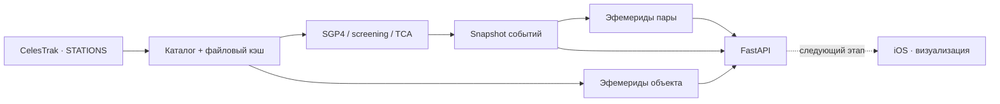

<div align="center">

<sub>SPACE SITUATIONAL AWARENESS · BACKEND</sub>

# Satellite Collision Predictor

**Орбитальные данные. Прогноз сближений. Траектории во времени.**

API для исследования близких прохождений орбитальных объектов<br>
и визуализации результатов в нативном iOS-приложении.

`Python` · `FastAPI` · `SGP4` · `SciPy`

[Быстрый запуск](#quickstart) · [Архитектура](#architecture) · [API](#api) · [Развитие](#roadmap)

</div>

---

> **Статус: исследовательский прототип.** Проект рассчитывает close approaches:
> время максимального сближения, расстояние и относительную скорость.
> Вероятность столкновения не оценивается — covariance/uncertainty данных пока нет.

## Что делает backend

| Возможность | Результат |
| :--- | :--- |
| **Каталог объектов** | Загрузка CelesTrak STATIONS, поиск по имени и NORAD ID |
| **Conjunction screening** | Поиск кандидатов на сближение и уточнение TCA |
| **Метрики события** | Miss distance в km, relative velocity в km/s, время TCA |
| **Эфемериды** | Позиции и скорости объекта на заданном временном интервале |
| **Траектории пары** | Общая временная сетка вокруг TCA с исходными elements расчёта |
| **Состояние данных** | Готовность каталога, этап screening и время последнего успешного результата |

**Текущий охват — группа STATIONS.** Это ограниченный каталог, а не вся
орбитальная обстановка. Мобильное приложение пока использует собственные демоданные;
подключение к этому API — следующий этап.

<a id="quickstart"></a>

## Быстрый запуск

Выполни из корня проекта. Если `.venv` уже настроен, переходи сразу к запуску сервера.

```sh
python3 -m venv .venv
.venv/bin/python -m pip install -r requirements.txt
```

```sh
.venv/bin/python -m uvicorn main:app --host 127.0.0.1 --port 18085
```

| Открыть | Для чего |
| :--- | :--- |
| [Swagger UI](http://127.0.0.1:18085/docs) | Посмотреть модели и выполнить запросы |
| [Health](http://127.0.0.1:18085/health) | Проверить процесс и готовность данных |
| [Screening status](http://127.0.0.1:18085/conjunctions/status) | Узнать состояние текущего расчёта |

API доступен сразу. Каталог загружается и screening выполняется в фоне.
После завершения цикл ждёт **30 минут**; срок свежести файлового кэша — **2 часа**.
Для загрузки свежего каталога нужен доступ к CelesTrak.

<details>
<summary>Примечание о текущем Python-окружении</summary>

Локальное `.venv` использует Python 3.9 с LibreSSL, из-за чего urllib3 выводит
предупреждение. HTTP smoke-проверка прошла. Для поддерживаемого окружения нужен
отдельный переход на современный Python с OpenSSL и повторная проверка зависимостей.
Версии текущего окружения закреплены в [requirements.txt](requirements.txt).

</details>

<a id="architecture"></a>

## Как устроен расчёт



Backend отвечает за orbital elements, propagation и screening.
Клиент получает результаты и временные выборки для визуализации.

**Согласованность события:** траектории пары строятся по тем же экземплярам объектов
и orbital elements, что использовал screening. Обновление каталога не подменяет
исходные данные уже рассчитанного события.

<details>
<summary>Навигация по коду</summary>

```text
.
├── main.py                       # FastAPI и фоновый цикл
├── predictor.py                  # Screening и уточнение сближений
├── satellite.py                  # Объект и SGP4-состояние
├── api/routes/                   # HTTP endpoints и ошибки
├── services/
│   ├── catalog_service.py        # Каталог и его состояние
│   ├── screening_service.py      # Расчёт и snapshot результатов
│   └── ephemeris_service.py      # Позиции/скорости по времени
├── schemas/                      # Модели публичного API
├── data/data_provider.py         # CelesTrak и файловый кэш
├── contracts/                    # OpenAPI и общий JSON-пример
└── tests/                        # Offline проверки API
```

</details>

<a id="api"></a>

## API

Все маршруты используют **GET**. Полная спецификация —
[contracts/openapi.json](contracts/openapi.json).

| Ресурс | Маршрут | Назначение |
| :--- | :--- | :--- |
| Система | `/health` | Процесс, каталог, screening |
| Каталог | `/satellites` | Поиск и пагинация |
| Объект | `/satellites/{norad_id}` | Имя и NORAD ID |
| Траектория | `/satellites/{norad_id}/ephemeris` | SGP4-позиции и скорости |
| Расчёт | `/conjunctions/status` | Состояние, окно и время расчёта |
| События | `/conjunctions` | Последний успешный результат, по TCA |
| Событие | `/conjunctions/{id}` | Метрики одной пары |
| Траектории пары | `/conjunctions/{id}/ephemeris` | Обе траектории вокруг TCA |

### Первые запросы

```sh
curl 'http://127.0.0.1:18085/satellites?query=ISS&limit=10'
curl 'http://127.0.0.1:18085/conjunctions/status'
curl 'http://127.0.0.1:18085/conjunctions?limit=10'
```

<details>
<summary>Параметры и ограничения запросов</summary>

| Запрос | Параметры | Ограничения |
| :--- | :--- | :--- |
| Списки | `limit`, `offset` | limit: 1–500; offset ≥ 0 |
| Поиск объектов | `query` | Имя или NORAD ID |
| Эфемериды объекта | `start`, `end`, `step_seconds` | Окно > 0 и ≤ 6 часов; шаг 1–600 s |
| Эфемериды пары | `seconds_before`, `seconds_after`, `step_seconds` | По 1–1800 s вокруг TCA; шаг 1–600 s |

Максимум **721 sample на объект**, включая дополнительные граничные точки.
По умолчанию для пары: 300 секунд до и после TCA, шаг 10 секунд.

Даты должны содержать часовой пояс. Рекомендуемый формат:
`2026-09-08T00:00:00Z`. При передаче положительного UTC offset в URL символ `+`
нужно кодировать как `%2B`.

</details>

### Пример события

Вымышленный fixture для проверки общего Python/Swift-контракта — **не реальный прогноз**.

```json
{
  "id": "demo-0-1",
  "satellite_1": {
    "name": "Aurora",
    "norad_id": 900001
  },
  "satellite_2": {
    "name": "Kepler",
    "norad_id": 900002
  },
  "miss_distance_km": 11.09,
  "relative_velocity_km_s": 12.4,
  "tca": "2026-09-08T02:14:00.125Z",
  "computed_at": "2026-09-08T00:00:00.250Z"
}
```

**TCA** (Time of Closest Approach) — момент максимального сближения.
**Miss distance** — расстояние между объектами в этот момент.

ID зависит от пары и TCA: он стабилен внутри snapshot, но может измениться после
перерасчёта. Старый ID может вернуть `404`; это ещё не постоянный ID инцидента.

### Координаты и время

| Поле | Значение |
| :--- | :--- |
| `frame` | `TEME` |
| `time_scale` | `UTC` |
| `position_unit` | `km` |
| `velocity_unit` | `km/s` |
| `propagation_model` | `SGP4` |
| `element_epoch` | Эпоха использованных orbital elements |
| `computed_at` | Время формирования ответа |

Каждый элемент `samples` содержит время, позицию и скорость.
Точный конец окна включён; для пары дополнительно включён точный TCA.
Клиент должен читать timestamps, а не предполагать строго равномерный шаг.

**TEME нельзя считать Earth-fixed координатами.** Для 3D Земли потребуется
проверенное преобразование в систему рендеринга и синхронизация вращения Земли.

### Готовность и ошибки

| Состояние | Поведение |
| :--- | :--- |
| Процесс запущен | `/health` возвращает 200; готовность данных проверяется отдельно |
| Каталог ещё загружается | Список объектов пуст, `catalog.ready = false` |
| Первый screening не завершён | `/conjunctions` возвращает 503 |
| Расчёт завершён без событий | Успешный ответ с пустым списком |
| Обновление завершилось ошибкой | Предыдущий успешный snapshot сохраняется |
| Объект/событие не найдено | 404 |
| Параметры или окно некорректны | 422 |
| SGP4 не смог построить траекторию | 503 |

Проверяй `status`, `computed_at` и окно расчёта: доступный ответ может содержать
предыдущие результаты. Состояния screening: `pending`, `running`, `ready`, `failed`.

## Проверки

```sh
.venv/bin/python -m unittest discover -s tests -v
```

**10 offline-тестов** проверяют готовность API, поиск и ошибки, лимиты,
часовые пояса, сохранение snapshot при сбое, ID событий, согласованность elements
пары, включение точного TCA и общий JSON-контракт.

Проверки API не доказывают полноту и точность orbital screening.

<a id="roadmap"></a>

## Следующие этапы

| Этап | Работа |
| :--- | :--- |
| **Подключение iOS** | URLSession repository, loading/error, отображение свежести данных |
| **Реальные траектории** | Преобразование TEME, интерполяция samples, синхронизация 3D-сцены |
| **Валидация engine** | Полнота поиска, повторные минимумы, ошибки SGP4 и устаревшие elements |
| **Расширение каталога** | Batch API и уровни детализации для большого числа объектов |
| **Production-инфраструктура** | Отдельный worker, очередь и постоянное хранилище |

<details>
<summary>Текущие ограничения engine и инфраструктуры</summary>

- Результаты хранятся в памяти. Нужен **один uvicorn worker**: каждый дополнительный
  процесс запустит собственный screening.
- Отмена asyncio task не останавливает уже выполняющийся CPU-поток.
- Один bounded-minimize на длинном интервале не гарантирует обнаружение всех
  сближений. Полноту поиска необходимо проверять отдельно.
- Связанные и отделяемые объекты группы STATIONS требуют отдельной интерпретации.
- Запрос эфемерид для каждого объекта по отдельности не масштабируется на большой каталог.
- Без covariance/uncertainty данных результаты не являются оценкой вероятности столкновения.

</details>

<details>
<summary>Карта изменений для разработки: файл → место → было/стало → причина</summary>

| Файл, тип/функция, место | Было → стало | Почему здесь |
| --- | --- | --- |
| main.py: lifespan и update_loop | Запуск ждал вычислений → сразу доступен API, один последовательный фоновый цикл | Управление жизненным циклом приложения |
| services/catalog_service.py: CatalogService.load, getters/status | Каталог без атомарного состояния → замена полного snapshot, поиск, метаданные и сохранение при ошибке | Владелец каталога |
| services/screening_service.py: ScreeningService.run_screening, snapshot/status | Результат без согласованного состояния → snapshot событий и времени, running/error, запрет параллельных расчётов | Владелец результата screening |
| data/data_provider.py: fetch_satellites | Кэш зависел от cwd → путь от файла, запись через временный файл | Слой получения и кэширования elements |
| predictor.py: начало candidate_pairs_at_time | KD-tree мог получать пустой каталог → ранний выход при числе объектов меньше двух | Проверка предусловия алгоритма |
| api/routes/health.py: health | Только сигнал процесса → также готовность данных | Диагностический endpoint |
| api/routes/satellites.py: список, detail, ephemeris | Только список → поиск, пагинация, деталь и траектория | HTTP-параметры и коды ошибок |
| api/routes/conjunctions.py: serialize, list/detail/status/ephemeris | Только список → ID, snapshot metadata, деталь и траектории пары | HTTP-контракт событий |
| schemas/conjunction.py: модели ответа | Без ID/статуса → ID, computed_at и расширенный статус | Проверяемый публичный формат |
| schemas/ephemeris.py: новые модели | Не было → явные frame/units/time и samples | Устраняет неоднозначность координат |
| services/ephemeris_service.py: новый build_ephemeris | Не было → ограниченный по размеру SGP4-запрос | Вычисления отделены от HTTP |
| tests/test_api.py и fixtures | Не было → offline проверки API и ошибок | Не зависят от CelesTrak и текущего времени |
| requirements.txt, .gitignore, contracts/ | Не было → версии зависимостей, исключение локальных файлов, общий формат | Воспроизводимость разработки |

</details>

---

<sub>Satellite Collision Predictor · Close-approach research & visualization</sub>
